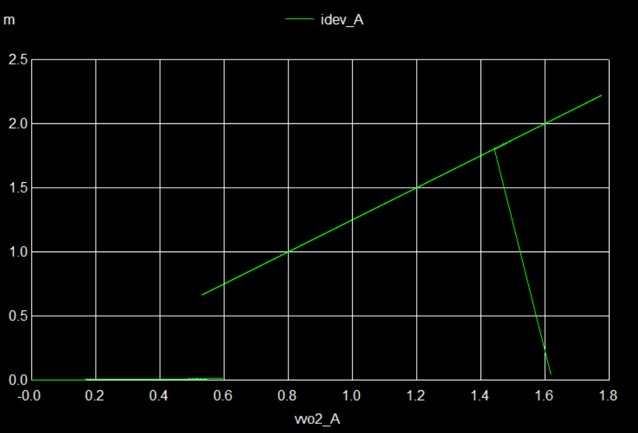
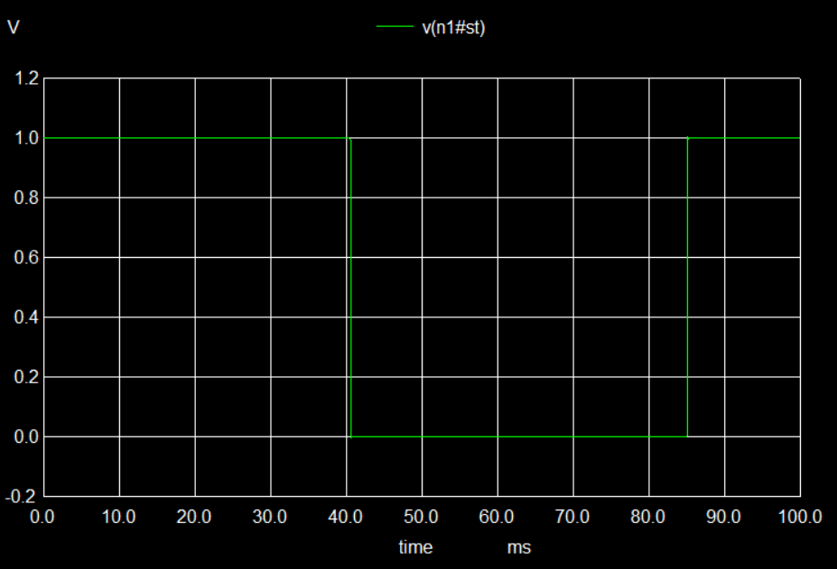
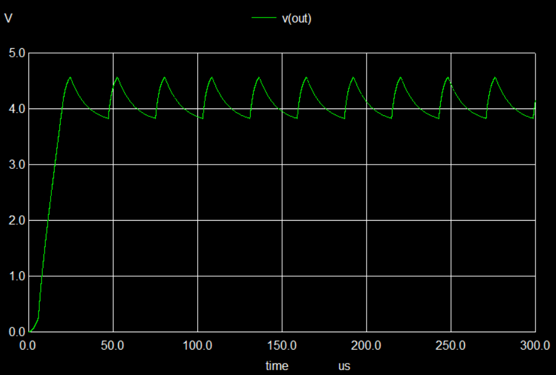
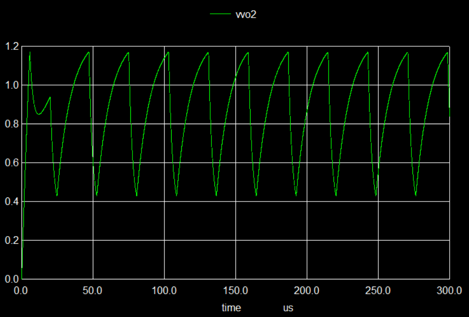
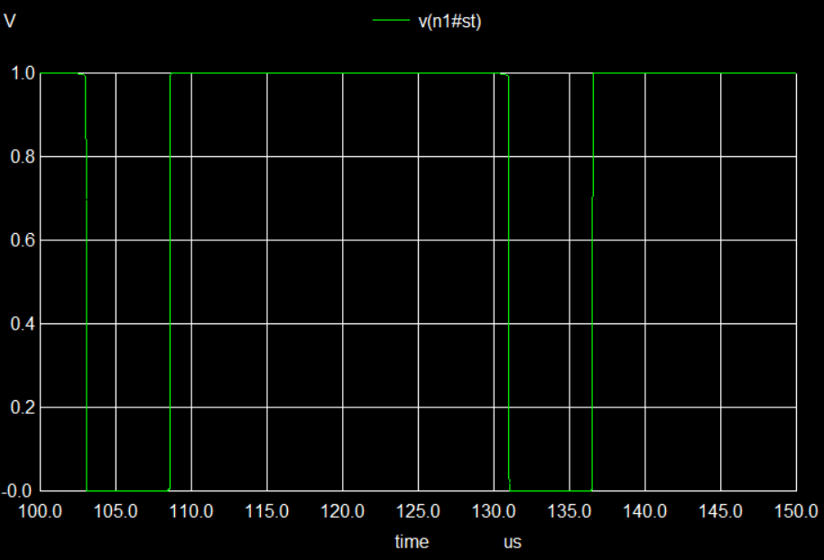

# Results — VO2 insulator-metal-transition threshold switching

Model: `VO2_Maffezzoni.va` · OpenVAF 23.2.0 → OSDI → ngspice 46 (Windows)
Source paper: Debets et al., IEEE JETCAS 16(2), June 2026.

**Method note.** Every "predicted" value below was computed by solving the model's
equations numerically **before** the corresponding test was run. Tests were not tuned
to produce agreement.

---

## Summary

| What was checked | Paper / theory | Measured | Verdict |
|---|---|---|---|
| Switch-on threshold | `VIMT` = 1.65 V | 1.62 V | match |
| Switch-off threshold | `VMIT` = 0.50 V | 0.52 V | match |
| Oscillation frequency | 35.80 kHz | 35.77 kHz | match |
| Output swing | 3.80 – 4.60 V | 3.83 – 4.57 V | match |
| Upper bias boundary | 42.8 kOhm | 41k works, 45k fails | match |
| Period from eq. 7 | 33.0 us (ideal switch) | 27.8 us | explained |
| Frequency peak (eq. 12) | 34.0 kOhm | <= 32.5 kOhm | **open** |
| Transition shape at 1 kOhm | vertical snap | traced | **deviation** |

Compile status: clean, no warnings.

---

## Test 1 — Static I-V sweep

Testbench: `test1_static_iv.cir` · parameters: **static** fit
VDD swept 0 -> 2 V -> 0 over 100 ms (quasi-static, no capacitor).
Two branches run simultaneously: `Rext` = 100 Ohm and `Rext` = 1 kOhm.

### 1a. Rext = 100 Ohm — clean match

| Quantity | Predicted | Measured | Table I |
|---|---|---|---|
| Switch-on voltage | ~1.62 V | **1.62 V** | `VIMT` = 1.65 V |
| Switch-off voltage | ~0.53 V | **0.52 V** | `VMIT` = 0.50 V |
| Peak current | 2.2 mA | **2.2 mA** at 1.78 V | — |

Reading the loop: current sits near 0.04 mA along the bottom (insulating, 50 kOhm),
jumps vertically at 1.62 V to ~1.8 mA, follows the straight metallic branch
`I = V / 800 Ohm` up to 2.2 mA, then on the return sweep stays conductive along that
same line far below the turn-on voltage, releasing only at 0.52 V.

The state plot cross-checks this in the time domain: state flips at **40.6 ms**
(VDD = 1.624 V) and returns at **85.3 ms** (VDD = 0.588 V, device voltage 0.52 V).

Same shape and same ~2 mA scale as the paper's Fig. 4.

### 1b. Rext = 1 kOhm — correct values, different transition shape

**Values are exact.** Peak current **1.11 mA at 0.889 V**. Theory: the metallic branch
sits at `Vvo2 = 0.444 * VDD`, giving 0.889 V and 1.111 mA at VDD = 2 V.

**Shape differs from the reference model.** The paper's model snaps vertically; this one
sweeps through a smooth curve from 0.88 V out to 1.6 V.

Ruled out as a smoothing artifact: `vsm` was tested at **10 mV, 1 mV and 0.2 mV** — a
50x reduction. The traced span stayed at ~0.8 V in every case.

**Cause: stable partial states.** With a continuous state variable, a half-switched
state is a valid equilibrium wherever `Vvo2(state) = Vth(state)`. Solving for how many
solutions exist:

| VDD | Rext = 100 Ohm | Rext = 1 kOhm |
|---|---|---|
| 1.2 V | one partial state | one partial state |
| 1.5 V | one partial state | one partial state |
| 1.8 V | **none** (fully ON or OFF) | **two** partial states |
| 2.0 V | none | none |

As the state varies, device voltage swings from `0.889*VDD` to `0.998*VDD` at 100 Ohm
(narrow) but from `0.444*VDD` to `0.98*VDD` at 1 kOhm (wide). The wider swing lets the
device voltage track the moving threshold, so partial equilibria stay stable over a wide
range and the sweep walks through them quasi-statically.

**Interpretation.** Maffezzoni's VO2 is an ideal two-state switch with no partial states.
Ours has them as a direct consequence of making the state continuous for solver
robustness — and no smoothing setting removes them, because the equilibrium exists for
any continuous interpolation. Arguably more physical (real VO2 does form partial
filaments), but it **is** a deviation from the reference model and is recorded as one.

Resolving it would require replacing the interpolated threshold with a genuine discrete
latch — more faithful, harder to converge. Not attempted.

---

## Test 2 — Relaxation oscillator

Testbench: `test2_oscillator.cir` · parameters: **dynamic** fit
Bias point from the paper: VDD = 5 V, `Rext` = 40 kOhm, `Cext` = 1 nF.
VDD ramped 0 -> 5 V over 20 us to guarantee startup.

| Quantity | Predicted | Measured |
|---|---|---|
| Output swing | 3.80 – 4.60 V | **3.83 – 4.57 V** |
| Frequency | 35.80 kHz | **35.77 kHz** |

The device-voltage plot is the more informative one: peaks at **~1.17 V** (`VIMT` = 1.2 V)
and troughs at **~0.43 V** (`VMIT` = 0.4 V). Both Table I thresholds are directly
readable off the waveform.

Oscillation condition check at this bias (paper eq. 1-4):

    Eins = 3.738 V  <  Vlo = 3.80 V     OK
    Vhi  = 4.60 V   <  Emet = 4.673 V   OK

Both hold, but by only 60 mV and 73 mV. That thin margin is why the bias window is
narrow — which Test 3 probes directly.

### Duty cycle

| Phase | Duration |
|---|---|
| Metallic | 5.7 us |
| Insulating | 22.1 us |
| Period | 27.8 us |

Ratio **3.9 : 1**, as expected — the capacitor charges through `Rmet` = 2.8 kOhm but
discharges through `Rins` = 13.5 kOhm.

### Why the period is 27.8 us and not 33.0 us

The paper's eq. 7 predicts 33.0 us using the **ideal** swing 3.80–4.60 V. It assumes
switching is instantaneous. Finite `tau` lets the capacitor overshoot slightly, so the
real swing is 3.830–4.571 V — narrower, hence a shorter period.

Feeding the **measured** swing back into the paper's own formula:

| Phase | Eq. 7 with measured swing | Simulated |
|---|---|---|
| Metallic | 5.5 us | 5.7 us |
| Insulating | 22.2 us | 22.1 us |

Both within a few percent. Model, simulation and the paper's analytical formula are
consistent; the 33 us figure simply assumes an ideal switch.

### Startup artifact (not a fault)

The first cycle differs from the rest — a small shoulder near 20 us at ~0.85 V that
never reappears. The VDD ramp is still finishing when the first switching event occurs,
so that cycle runs under a supply below 5 V. This is why the frequency measurement
starts at the 5th threshold crossing, not the 1st.

---

## Test 3 — Bias window and frequency

Testbench: `test3_freq_vs_rext.cir` · parameters: **dynamic** fit, VDD = 5 V, Cext = 1 nF.

Paper eq. 6 predicts the oscillation window:

    Rmin = Rmet * (VDD/VMIT - 1) = 2.8k  * 11.50 = 32.2 kOhm
    Rmax = Rins * (VDD/VIMT - 1) = 13.5k *  3.17 = 42.8 kOhm

### Measured

| Rext | Frequency |
|---|---|
| 33 kOhm | 49.48 kHz |
| 35 kOhm | 47.25 kHz |
| 37 kOhm | 43.47 kHz |
| 39 kOhm | 38.61 kHz |
| 41 kOhm | 32.62 kHz |
| 45 kOhm | **no oscillation** |

**The boundary prediction holds.** 41 kOhm oscillates, 45 kOhm does not, and eq. 6 puts
the edge at 42.8 kOhm — bracketed from both sides.

At 45 kOhm the **transient itself runs fine** (40 018 data rows, no convergence failure).
Only the `meas` commands fail, because there is no oscillation crossing the measurement
threshold. The error message is the expected result, not a bug.

### Non-linear decline

Frequency drops by -2.2, -3.8, -4.9, -6.0 kHz per 2 kOhm step, steepening toward `Rmax`.
This matches the paper's observation that their device shows a much less linear
relationship than the original Maffezzoni device.

### Independent cross-check

The OSDI/Verilog-A model gives **49.4799 kHz** at 33 kOhm. A separately written ngspice
B-source implementation of the same equations (not a translation) gives **49.4793 kHz** —
six significant figures apart. Evidence that the Verilog-A faithfully implements the
intended equations.

### Open: frequency peak location

Paper eq. 12 predicts the peak at:

    R_peakf = (1-beta)*Rmin + beta*Rmax,   beta = Rmet/(Rmet+Rins) = 0.172
            = 0.828*32.2 + 0.172*42.8 = 34.0 kOhm

(beta = 0.172 matches the paper's stated 0.17, confirming the parameters are right.)

A fine sweep from 32.5 kOhm upward found frequency decreasing **monotonically**, putting
the peak at or below 32.5 kOhm rather than at 34.0 kOhm.

The practical difference is small — 49.62 kHz at 32.5 kOhm vs 48.65 kHz at 34.0 kOhm,
about **2%**. The maximum is very flat, making it hard to localise.

A plausible explanation is that eq. 12 derives from eq. 7, which assumes instantaneous
switching — the same assumption already shown to cost 16% on the period. **This is a
hypothesis, not a demonstrated result.** Recorded as open.

Caveat: the fine sweep was run on the ngspice B-source equivalent, not the OSDI build.
Given the six-digit agreement above they are expected to match, but this has not been
confirmed on the OSDI model.

---

## Open items

1. **Coupled-pair testbench (paper Sec. V-D)** — two oscillators through a coupling
   resistance `Rc`, showing in-phase vs anti-phase locking and the no-oscillation gap.
   This is the paper's headline finding and is buildable from this model alone.
2. **Resolve the eq. 12 peak location** with a finer sweep on the OSDI build, including
   points below `Rmin`.
3. **Optional: true-latch variant** to reproduce the ideal vertical transition at
   1 kOhm, and compare convergence behaviour against the continuous version.
